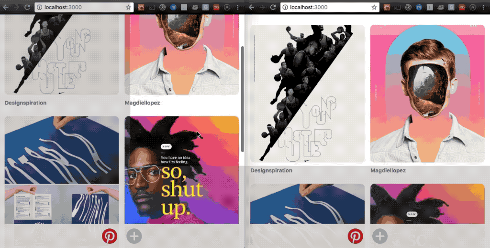

# Apollo Subscriptions Example



Pinterest style example showing how to setup Apollo Subscriptions.

Blog post: https://www.graphql.college/graphql-subscriptions-with-react-node-apollo-and-postgres/

## Technologies

⚛️ React

🚀 Apollo GraphQL

💾 Postgres

## Features

* **Add pin**. Uses React Apollo's [`<Query />`](https://www.apollographql.com/docs/react/essentials/queries.html#basic) component.
* **List pins**. Uses React Apollo's [`<Mutation />`](https://www.apollographql.com/docs/react/essentials/mutations.html#basic) component.
* **Update pin list in real time**.
  * Client: Uses [`<Query />`'s](https://www.apollographql.com/docs/react/essentials/queries.html#props) `subscribeToMore` property.
  * Server: Uses [`graphql-subscriptions`](https://github.com/apollographql/graphql-subscriptions) and [`graphql-postgres-subscriptions`](https://github.com/GraphQLCollege/graphql-postgres-subscriptions)

## Getting started

### Requirements

* Nodejs
* Postgres

### Installation

```sh
# Clone repo
git clone https://github.com/GraphQLCollege/apollo-subscriptions-example.git
# Install server dependencies
cd packages/server && yarn
# Setup environment variables
cp .env.example .env
# Create and migrate database
yarn db:create && yarn db:migrate
# Start server
yarn start
# Start client
cd ../client && yarn && yarn start
```
